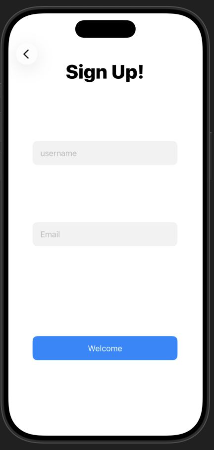
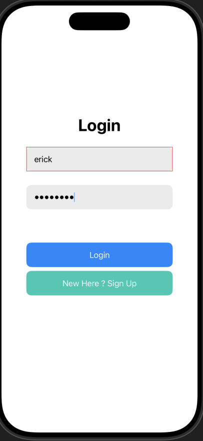
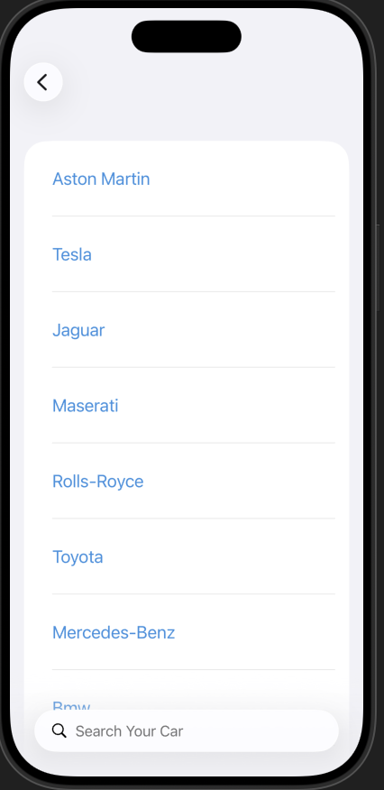

# Pre-Migration ParkerUp
 
The original Swift-based version of ParkerUp, developed before migrating to Flutter and Dart. This project served as the foundation for what ParkerUp is today — featuring a sign up and login page connected to a database that stored individual vehicle details.
 
---
 
## 📋 Table of Contents
 
- [Prerequisites](#prerequisites)
- [Getting Started](#getting-started)
- [Running Locally](#running-locally)
- [Screenshots](#screenshots)
- [Tech Stack](#tech-stack)
- [License](#license)
 
---
 
## Prerequisites
 
Before you begin, ensure you have the following installed on your machine:
 
- [Xcode](https://developer.apple.com/xcode/) (latest version recommended — macOS only)
- [CocoaPods](https://cocoapods.org/) (dependency manager for Swift projects)
 
> **Note:** To verify your Xcode installation, run `xcode-select --version` in your terminal. To install CocoaPods, run `sudo gem install cocoapods`.
 
---
 
## Getting Started
 
### 1. Clone the Repository
 
```bash
git clone https://github.com/marcelodamian/pre-migration-parkerup.git
cd pre-migration-parkerup
```
 
### 2. Install CocoaPods Dependencies
 
```bash
pod install
```
 
> **Important:** After running `pod install`, always open the project using the `.xcworkspace` file — **not** the `.xcodeproj` file. Opening the wrong file will cause build errors.
 
```bash
open ParkerUp.xcworkspace
```
 
---
 
## Running Locally
 
Once the project is open in Xcode:
 
1. Select your target device or simulator from the device picker in the top toolbar (e.g. **iPhone 15 Simulator**)
2. Press the **Play ▶ button** (or `Cmd + R`) to build and run the app
3. The app will launch in the iOS Simulator with the sign up and login screens
 
---
 
## Images
 
 
### Sign Up Screen

 
### Login Screen

 
### Vehicle Details

 

 
## Tech Stack
 
| Technology | Purpose |
|---|---|
| [Swift](https://www.swift.org/) | Core programming language |
| [Xcode](https://developer.apple.com/xcode/) | IDE & iOS Simulator |
| [CocoaPods](https://cocoapods.org/) | Dependency management |
| [UIKit](https://developer.apple.com/documentation/uikit) | UI framework |
 
---
